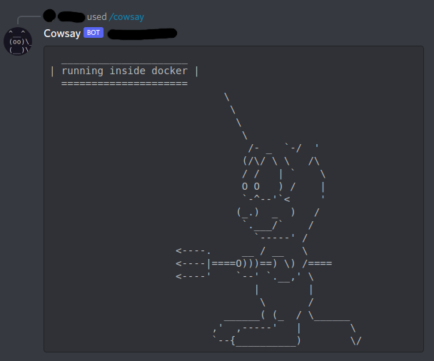

# Cowsay Bot

A cowsay discord bot written in python

## Usage

### Preparation

1. Create a Discord bot. You can follow tutorials such as [this](https://www.freecodecamp.org/news/create-a-discord-bot-with-python/). You need the token of the bot for later steps. You can skip the OAuth2 part.
1. Obtain the guild ID of all the servers your bot will join. I did not test my project with bot invitation.

### Venv Usage

1. Create and use `venv`: `python3 -m venv .venv && . .venv/bin/activate`
1. Install dependencies: `pip install -r requirements.txt`
1. Star the bot: `TOKEN="your token" GUILD_IDS="guild IDs separated by a single space" ./cowsay-bot`

### Docker Usage

1. `docker build -t "cowsay-bot" .`
1. `docker run -e "TOKEN=your token" -e "GUILD_IDS=guild IDs separated by a single space" cowsay-bot.py`
