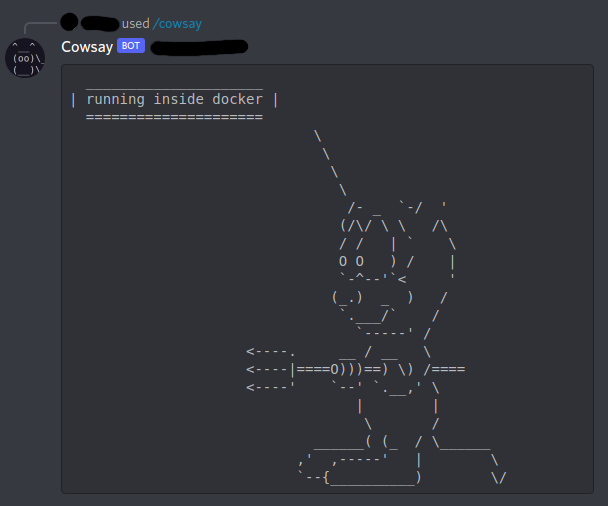

# Cowsay Bot

A cowsay discord bot written in python

## Usage

### Preparation

1. Create a Discord bot. You can follow tutorials such as [this](https://www.freecodecamp.org/news/create-a-discord-bot-with-python/). You need the token of the bot for later steps.
1. Obtain the guild ID of all the channels your bot will message.
1. Follow this post to invite your bot to a server: https://stackoverflow.com/a/37743722

