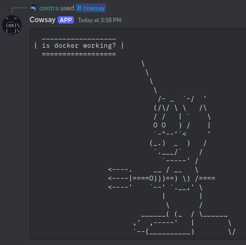

# Cowsay Bot

A cowsay discord bot written in python

## Usage

### Preparation

1. Create a Discord bot. You can follow tutorials such as [this](https://www.freecodecamp.org/news/create-a-discord-bot-with-python/). You need the token of the bot for later steps.
1. Obtain the guild ID of all the servers your bot will join.
1. Follow this post to invite your bot to a server: https://stackoverflow.com/a/37743722

### Venv Usage

1. Create and activate `venv`: `python3 -m venv .venv && . .venv/bin/activate`
1. Install dependencies: `pip install -r requirements.txt`
1. Define environment variables: `TOKEN="your token"` and `GUILD_IDS="guild IDs separated by comma"`.
You can use a `.env` file or pass it directly to cowsay-bot.py
1. Star the bot: `./cowsay-bot.py`

### Docker Usage

1. `docker build -t "cowsay-bot" .`
1. `docker run -e "TOKEN=your token" -e "GUILD_IDS=guild IDs separated by comma" cowsay-bot`
